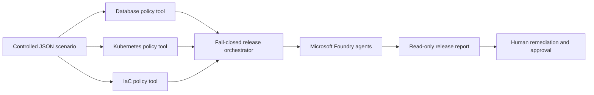

# ChangeShield

> **Read-only, fail-closed governance for high-risk production releases.**

[](https://www.python.org/)
[](https://ai.azure.com/)
[](https://azure.microsoft.com/)
[](https://ai.azure.com/)
[](changeshield/README.md#four-foundry-agents)
[](changeshield/README.md#safety-model)
[](changeshield/README.md#scope-and-next-steps)

ChangeShield is a multi-agent governance system that assesses high-risk production releases across database migrations, Kubernetes releases, and Infrastructure as Code (IaC). Deterministic policy tools produce authoritative findings; Microsoft Foundry agents generate structured reports and observable traces.

> [!IMPORTANT]
> ChangeShield is advisory and read-only. It never executes SQL, `kubectl`, Helm, Terraform, Azure APIs, or production changes.

## Demonstrated result

```text
Scenario: CS-REL-001
Release: payment-platform-production-release

Decision: BLOCK
Risk score: 100/100
Risk level: HIGH
Blocking specialists: database, kubernetes, iac
Execution permitted: false
```

## Architecture



## What is included

| Capability | Implementation |
|---|---|
| Production domains | Database migrations, Kubernetes releases, IaC governance |
| Policy enforcement | 3 deterministic, local, read-only Python tools |
| Foundry agents | 4 versioned agents using `gpt-5.4-mini` |
| Decision rule | Any specialist `BLOCK` forces consolidated `BLOCK` |
| Demonstration | `CS-REL-001` with 22 consolidated findings |
| Observability | Foundry traces with duration, tokens, version, and estimated cost |

## Explore ChangeShield

### Full documentation

➡️ **[Open the complete ChangeShield documentation](changeshield/README.md)**

The full documentation includes:

- Detailed architecture and Mermaid diagram
- Four Foundry agents and three policy engines
- Fail-closed safety model
- Local quick start and Foundry runbook
- Demonstration scenario and remediation
- Screenshots and trace evidence
- Limitations and next steps

### Key evidence

| Evidence | Link |
|---|---|
| Foundry model deployment | [View screenshot](changeshield/docs/screenshots/02-foundry-model-deployment.png) |
| Orchestrator configuration | [View screenshot](changeshield/docs/screenshots/10-release-orchestrator-playground.png) |
| Orchestrator traces | [View screenshot](changeshield/docs/screenshots/11-release-orchestrator-traces.png) |
| Consolidated local output | [View JSON](changeshield/docs/high-risk-production-release-orchestration-output.json) |
| Foundry report | [View report](changeshield/docs/production-release-orchestrator-foundry-output.md) |

## Repository layout

```text
.
├── changeshield/       # ChangeShield implementation and full documentation
│   └── README.md       # Complete project README
├── factory/            # Microsoft Foundry hackathon setup and provisioning
└── README.md           # Repository landing page
```

## Safety boundary

The demo uses controlled, simulated scenario data. No live database, Kubernetes cluster, Terraform backend, Azure subscription, or production deployment system is contacted.

Any future execution capability must remain separate from policy assessment, require explicit human approval, and remain unable to bypass deterministic `BLOCK` decisions.

## Quick start

```bash
python -m venv .venv
source .venv/bin/activate
pip install azure-ai-projects azure-identity python-dotenv openai

python - <<'PY'
import sys
from pathlib import Path

sys.path.insert(0, str(Path("changeshield/src").resolve()))

from agents.release_orchestrator import analyze_production_release

result = analyze_production_release("CS-REL-001")

print("Decision:", result["decision"])
print("Risk score:", f'{result["consolidated_risk_score"]}/100')
print("Blocking specialists:", ", ".join(result["blocking_specialists"]))
print("Execution permitted:", result["execution_permitted"])
PY
```

For the complete runbook and all evidence, see the **[full ChangeShield README](changeshield/README.md)**.

---

## Original hackathon setup

The [`factory/`](factory/) directory contains Microsoft Foundry setup and provisioning materials inherited from the original hackathon repository. The ChangeShield implementation and project-specific documentation live under [`changeshield/`](changeshield/).
