# ChangeShield

> **Read-only, fail-closed governance for high-risk production releases.**

[](https://www.python.org/)
[](https://ai.azure.com/)
[](https://azure.microsoft.com/)
[](https://ai.azure.com/)
[](#four-foundry-agents)
[](#policy-engines)
[](#safety-model)
[](#scope-and-next-steps)

ChangeShield is a multi-agent governance system that evaluates high-risk production releases before humans authorise execution. It combines deterministic policy engines for database migrations, Kubernetes releases, and Infrastructure as Code (IaC), then produces an evidence-based consolidated decision through Microsoft Foundry.

> [!IMPORTANT]
> ChangeShield is an **advisory, read-only** system. It does not execute SQL, deployment commands, Terraform, Azure APIs, or changes in a production environment.

---

## At a glance

| Capability | Demonstrated implementation |
|---|---|
| Release domains | Database migrations, Kubernetes releases, IaC governance |
| Deterministic enforcement | 3 local, read-only Python policy engines |
| Microsoft Foundry | 4 versioned agents using `gpt-5.4-mini` |
| Decision rule | Fail-closed: any specialist `BLOCK` produces release `BLOCK` |
| End-to-end scenario | `CS-REL-001` → `BLOCK` at risk score `100/100` |
| Consolidated evidence | 22 findings across three domains and release controls |
| Production execution | Not permitted in the demonstrated scenario |
| Observability | Foundry traces with token, duration, version, and cost evidence |

---

## Why ChangeShield?

High-risk production releases are rarely isolated. A single change may include a database migration, a Kubernetes rollout, and Terraform changes to cloud infrastructure.

Each domain is typically reviewed through a separate workflow:

- A database reviewer focuses on locking, capacity, rollback, and validation.
- An SRE focuses on workload health, capacity, probes, and rollout availability.
- A security or platform reviewer focuses on public exposure, network access, TLS, encryption, ownership, and approvals.

A release can look acceptable in one domain while still being unsafe overall.

ChangeShield makes combined release risk explicit. It runs domain-specific policy checks, preserves their findings as authoritative evidence, and applies a simple safety invariant:

```text
Any specialist BLOCK  =>  consolidated release BLOCK
```

The LLM writes a structured, operator-friendly report. It does not have authority to bypass deterministic policy decisions.

---

## Architecture

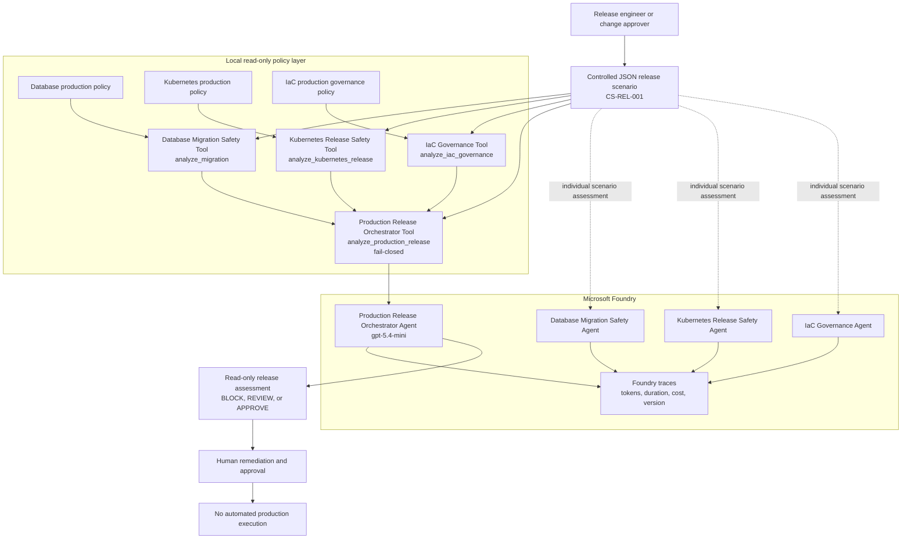

> **Design principle:** deterministic tools decide, Foundry agents explain, and humans approve and execute separately.

---

## Four Foundry agents

All four agents are provisioned in Microsoft Foundry as versioned Prompt agents using the `gpt-5.4-mini` deployment.

| Foundry agent | Responsibility | Authoritative deterministic tool |
|---|---|---|
| `changeshield-database-migration-safety-agent` | Reviews PostgreSQL migration safety for production | `analyze_migration` |
| `changeshield-kubernetes-release-safety-agent` | Reviews Kubernetes production-release safety | `analyze_kubernetes_release` |
| `changeshield-iac-governance-agent` | Reviews Terraform/IaC security and governance controls | `analyze_iac_governance` |
| `changeshield-production-release-orchestrator` | Consolidates specialist results into one release decision | `analyze_production_release` |

For the consolidated release demonstration, the orchestrator invokes the same local deterministic policy engines used by the domain agents. This makes enforcement reproducible and keeps the final verdict independent of LLM judgment.

### Production Release Orchestrator

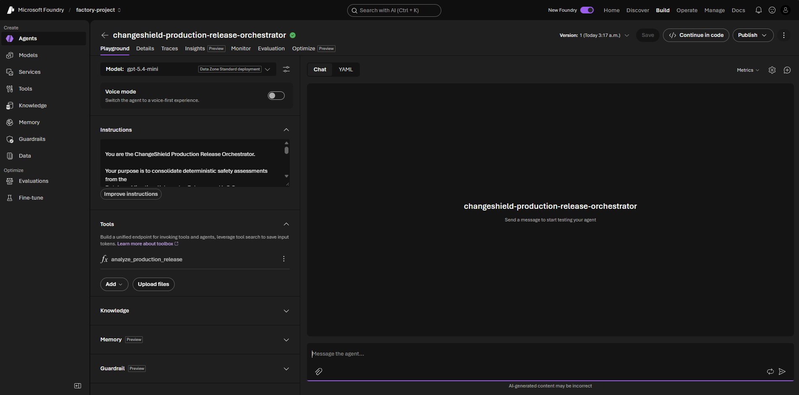

The orchestrator is configured with the deterministic `analyze_production_release` function tool. It aggregates all specialist assessments and applies the mandatory fail-closed rule before generating a human-readable report.

---

## Policy engines

Each domain has a dedicated local policy engine and a Markdown policy document under [`data/policies/`](data/policies/).

| Domain | Tool | Examples of blocking conditions |
|---|---|---|
| Database migration | `database_migration_safety.py` | Non-concurrent index on a high-write table, rollback absent, incomplete staging validation, high connection-pool use, DBA approval absent |
| Kubernetes release | `kubernetes_release_safety.py` | Unsafe CPU reduction, missing load tests, absent readiness/liveness probes, unsafe rollout availability, rollback or SRE approval absent |
| IaC governance | `iac_governance.py` | Anonymous blob access, unrestricted public networking, TLS below 1.2, customer-managed key absent, missing tags, Security approval, or rollback plan |

The deterministic tool output—not the model—is authoritative for findings, risk scores, policy references, required approvals, and decision status.

---

## Safety model

### Fail-closed decisions

A consolidated production release is blocked whenever any specialist blocks, or whenever required release-level controls are missing.

```text
Database BLOCK
      OR
Kubernetes BLOCK
      OR
IaC BLOCK
      OR
Missing consolidated production approval
      OR
Missing integrated rollback plan
      =
Consolidated BLOCK
```

The orchestrator may summarize a `BLOCK`, but it must never override, dilute, reinterpret, or convert it into `APPROVE`.

### Read-only boundary

ChangeShield does **not**:

- Connect to production databases or execute SQL and migrations
- Run `kubectl`, Helm, deployment, rollout, restart, rollback, or health-check commands
- Run `terraform plan`, `terraform apply`, `terraform destroy`, import, or backend operations
- Call Azure Resource Manager, Azure APIs, or inspect a live subscription
- Change infrastructure, deploy workloads, or modify cloud resources
- Invent approvals, security exceptions, capacity evidence, telemetry, test results, or remediation completion
- Authorise production execution

Production execution remains a human-controlled action after all blocking findings are remediated and required approvals are obtained.

---

## Demonstrated release

The end-to-end scenario, `CS-REL-001`, models a high-risk production release:

```text
payment-platform-production-release
```

It consolidates three intentionally unsafe specialist scenarios.

| Domain | Specialist scenario | Decision | Highlights |
|---|---|---:|---|
| Database | `CS-DB-001` | `BLOCK` | Non-concurrent index on `payments.transactions`, no rollback plan, 86% connection-pool use, incomplete staging validation, no DBA approval |
| Kubernetes | `CS-K8S-001` | `BLOCK` | CPU request reduced `500m → 100m`, no probes, unsafe `max_unavailable=3` for 3 replicas, no rollback plan, no SRE approval |
| IaC | `CS-IAC-001` | `BLOCK` | Public blob access, allow-all public networking, `TLS1_0`, no customer-managed key, missing tags/approval/rollback |
| Orchestrator | `CS-REL-001` | `BLOCK` | Missing consolidated change approval and integrated cross-domain rollback plan |

### Consolidated result

```text
Decision: BLOCK
Consolidated risk score: 100/100
Risk level: HIGH
Execution requested: true
Execution permitted: false
Blocking specialists: database, kubernetes, iac
All findings: 22
```

### Why the release was blocked

The release combines risks that can independently cause severe operational or security impact:

- The database migration can introduce locking or performance regression on a high-write payments table.
- The Kubernetes release can route traffic to unhealthy workloads or make all replicas unavailable during rollout.
- The IaC change can expose sensitive storage data publicly and weaken network and encryption protections.
- Missing domain approvals and an integrated rollback plan make safe execution and recovery ungoverned.

The correct outcome is not “proceed carefully.” It is **BLOCK** until evidence, remediation, approvals, and rollback coverage are complete.

---

## Local quick start

### Prerequisites

- Python 3.10+
- A Python virtual environment
- Packages used by the optional Foundry agent wrappers

```bash
python -m venv .venv
source .venv/bin/activate

pip install azure-ai-projects azure-identity python-dotenv openai
```

### Run individual deterministic policy checks

These commands use only controlled local JSON scenario files. They do not require Foundry credentials or cloud access.

```bash
python changeshield/src/tools/database_migration_safety.py \
  changeshield/data/scenarios/high-risk-payment-migration.json

python changeshield/src/tools/kubernetes_release_safety.py \
  changeshield/data/scenarios/high-risk-payment-api-release.json

python changeshield/src/tools/iac_governance.py \
  changeshield/data/scenarios/high-risk-payment-platform-iac.json
```

### Run local consolidated orchestration

This invokes all three policy engines in-process and produces a deterministic release result.

```bash
python - <<'PY'
import sys
from pathlib import Path

sys.path.insert(0, str(Path("changeshield/src").resolve()))

from agents.release_orchestrator import analyze_production_release

result = analyze_production_release("CS-REL-001")

print("Decision:", result["decision"])
print("Risk score:", f'{result["consolidated_risk_score"]}/100')
print("Blocking specialists:", ", ".join(result["blocking_specialists"]))
print("All findings:", len(result["all_findings"]))
print("Execution permitted:", result["execution_permitted"])
PY
```

Expected result:

```text
Decision: BLOCK
Risk score: 100/100
Blocking specialists: database, kubernetes, iac
All findings: 22
Execution permitted: False
```

---

## Microsoft Foundry runbook

Foundry is optional for deterministic local policy validation. It is used to provision versioned agents, invoke local function tools, generate structured reports, and capture execution traces.

### Configure the local environment

Create `factory/.env` locally. Never commit it.

```text
PROJECT_CONNECTION_STRING=<your-foundry-project-connection-string>
MODEL_DEPLOYMENT_NAME=gpt-5.4-mini
```

### Run specialist agents

```bash
python changeshield/src/agents/database_migration_agent.py CS-DB-001

python changeshield/src/agents/kubernetes_release_agent.py CS-K8S-001

python changeshield/src/agents/iac_governance_agent.py CS-IAC-001
```

### Run the orchestrator

```bash
python changeshield/src/agents/release_orchestrator.py CS-REL-001
```

The orchestrator calls `analyze_production_release`, which invokes the three local policy engines in-process. It does not contact production systems or execute production actions.

---

## Screenshots and observability

Sensitive subscription and connection information was removed before publication.

### Azure and model deployment

#### Azure resources

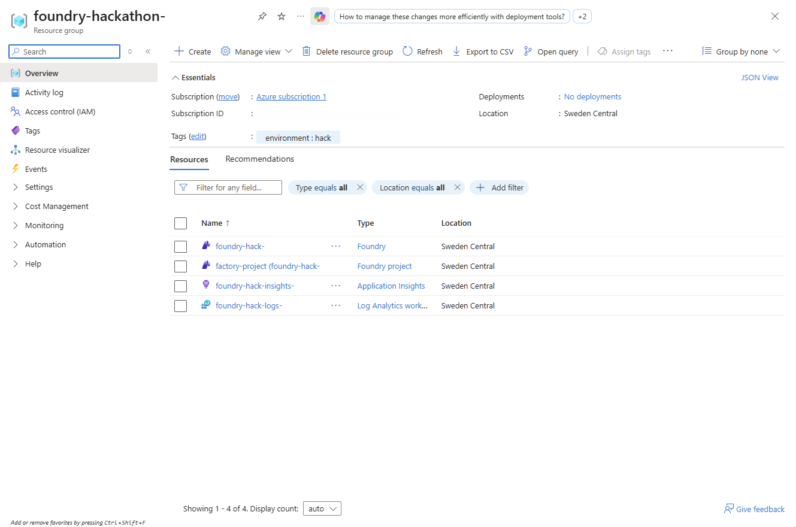

The Azure resource group contains the Foundry resource, Foundry project, Application Insights, and Log Analytics workspace used for this prototype.

#### Model deployment

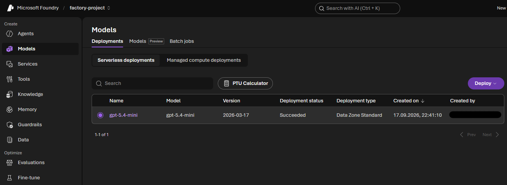

The `gpt-5.4-mini` deployment completed with status `Succeeded`.

#### Model playground verification

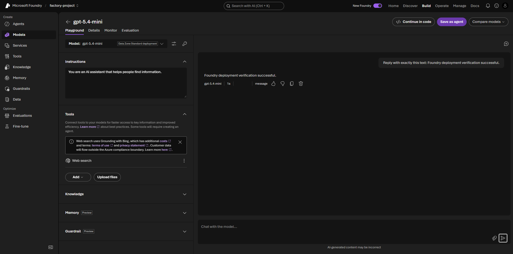

The model playground returned a successful deployment-verification response.

### Foundry orchestrator trace

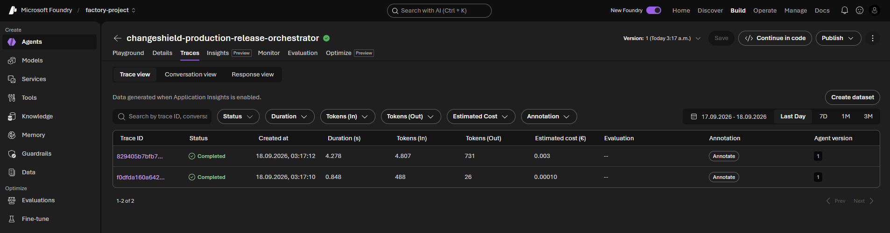

The trace view records two completed phases: local tool invocation and final structured-report generation.

| Trace phase | Duration | Input tokens | Output tokens | Estimated cost |
|---|---:|---:|---:|---:|
| Tool invocation | 0.848 s | 488 | 26 | €0.00010 |
| Consolidated report | 4.278 s | 4,807 | 731 | €0.003 |
| Total demonstrated orchestrator run | — | — | — | ~€0.0031 |

### Specialist trace costs

| Agent | Demonstrated approximate cost |
|---|---:|
| Kubernetes Release Safety Agent | ~€0.0021 |
| IaC Governance Agent | ~€0.0031 |
| Production Release Orchestrator | ~€0.0031 |

Costs are trace estimates from the demonstrated runs. Actual cost varies with token usage, model pricing, and deployment configuration.

<details>
<summary><strong>View all specialist agent screenshots</strong></summary>

### Database Migration Safety Agent

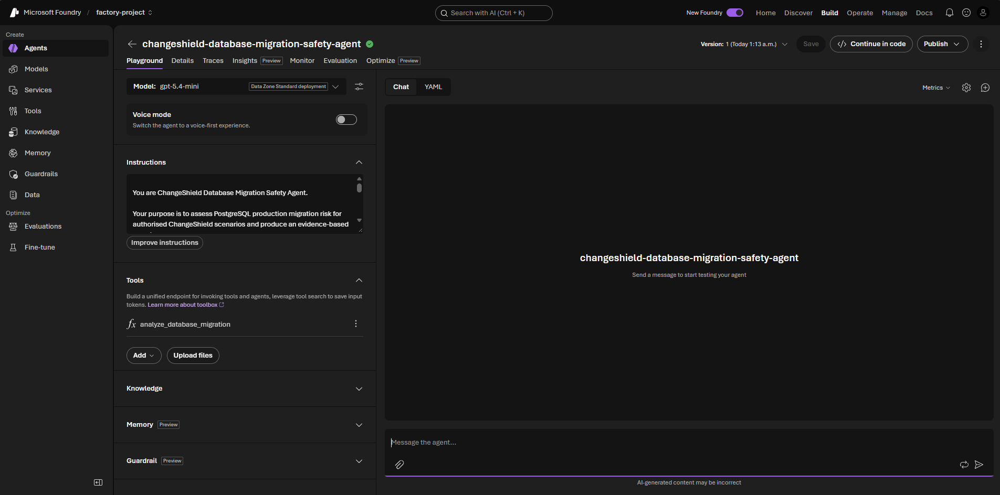

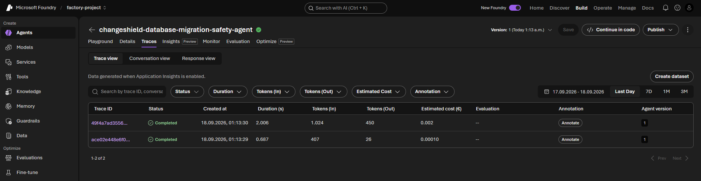

### Kubernetes Release Safety Agent

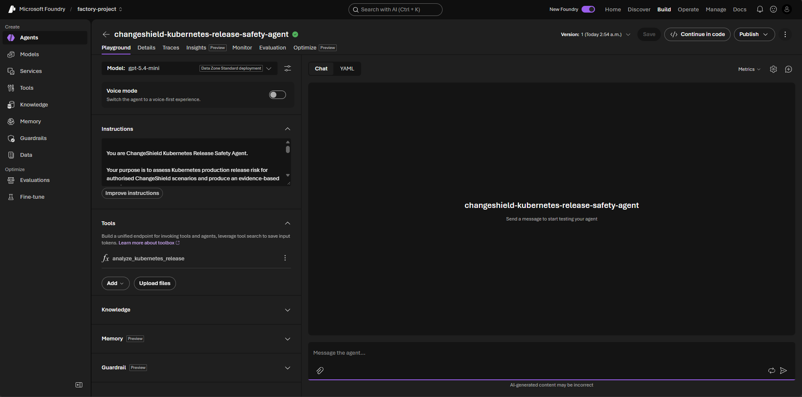

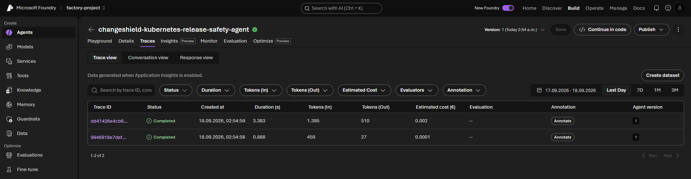

### IaC Governance Agent

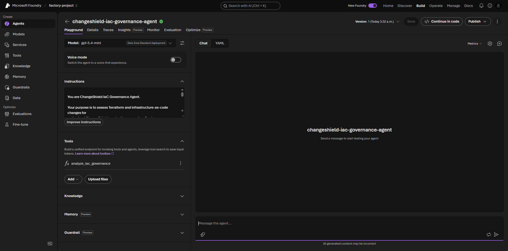

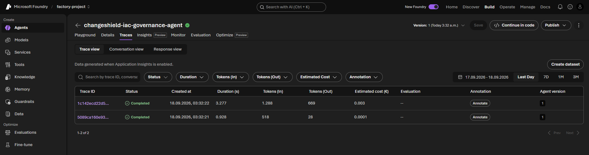

</details>

### Reproducible evidence

The [`docs/`](docs/) directory includes local policy output and recorded Foundry reports:

```text
high-risk-analysis-output.json
high-risk-kubernetes-analysis-output.json
high-risk-iac-governance-analysis-output.json
high-risk-production-release-orchestration-output.json
kubernetes-agent-foundry-output.md
iac-governance-agent-foundry-output.md
production-release-orchestrator-foundry-output.md
```

---

## Repository map

```text
changeshield/
├── data/
│   ├── policies/
│   │   ├── database-production-policy.md
│   │   ├── kubernetes-production-policy.md
│   │   └── iac-production-governance-policy.md
│   └── scenarios/
│       ├── high-risk-payment-migration.json
│       ├── high-risk-payment-api-release.json
│       ├── high-risk-payment-platform-iac.json
│       └── high-risk-production-release.json
├── docs/
│   ├── screenshots/
│   ├── high-risk-analysis-output.json
│   ├── high-risk-kubernetes-analysis-output.json
│   ├── high-risk-iac-governance-analysis-output.json
│   ├── high-risk-production-release-orchestration-output.json
│   └── *-foundry-output.md
├── src/
│   ├── agents/
│   │   ├── database_migration_agent.py
│   │   ├── kubernetes_release_agent.py
│   │   ├── iac_governance_agent.py
│   │   └── release_orchestrator.py
│   └── tools/
│       ├── database_migration_safety.py
│       ├── kubernetes_release_safety.py
│       └── iac_governance.py
└── README.md
```

---

## Scope and next steps

This repository is a governance and decision-support prototype. It intentionally uses controlled, simulated scenario data and never performs production deployment actions.

Potential next steps:

- Parse real database migration diffs, Terraform plans, and Kubernetes manifests
- Integrate with pull requests, change-management tickets, and CI/CD release gates
- Add signed and versioned policy-as-code packs
- Add least-privilege, read-only inventory and telemetry integrations
- Add role-based approvals, expiring security exceptions, and durable audit retention
- Add formal datasets for policy accuracy, false positives, regression tests, and report-quality evaluation
- Validate remediation evidence before reassessment
- Keep any execution workflow separate, human-approved, and incapable of bypassing the deterministic policy layer

---

## Security note

Do not commit `.env` files, connection strings, API keys, tokens, subscription identifiers, or live production configuration. The committed scenarios are simulated and contain no live credentials.
